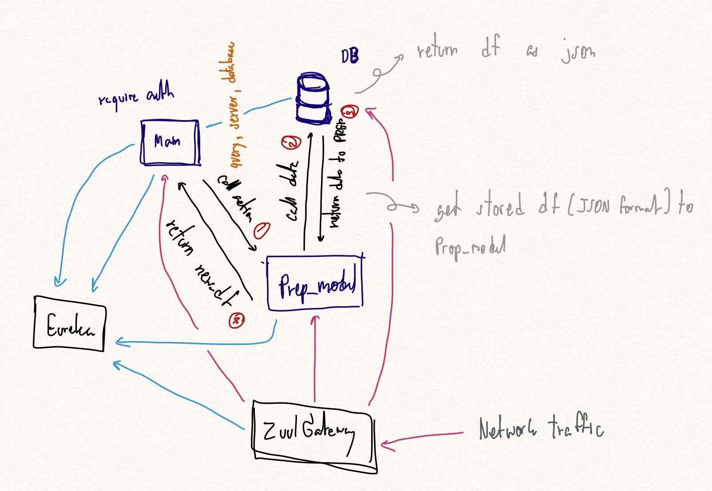

# microservice_with_prep_model
 Making model with eureka and ZuulGateway microservice
## How to start all the services
 1. Run EurekaDiscoveryService
 2. Run ZuulGatewayService
 3. Run main.py
 4. Run db_data_caller.py
 5. Run prep_model.py
 6. access the API with host of ZuulGateway(in this project's 127.0.0.1:9090)
 7. find routes for each service in ZuulGateway's application.yml

## Microservice Architecture

